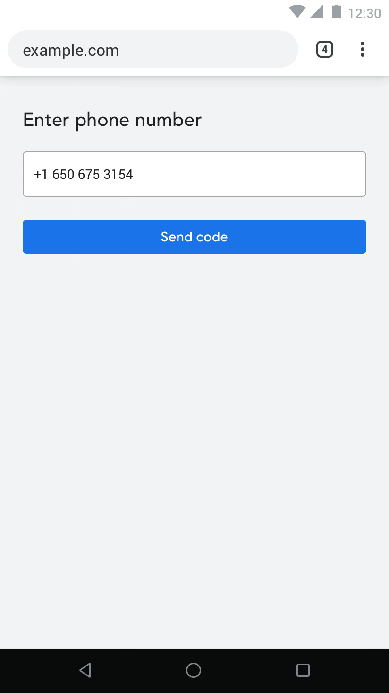
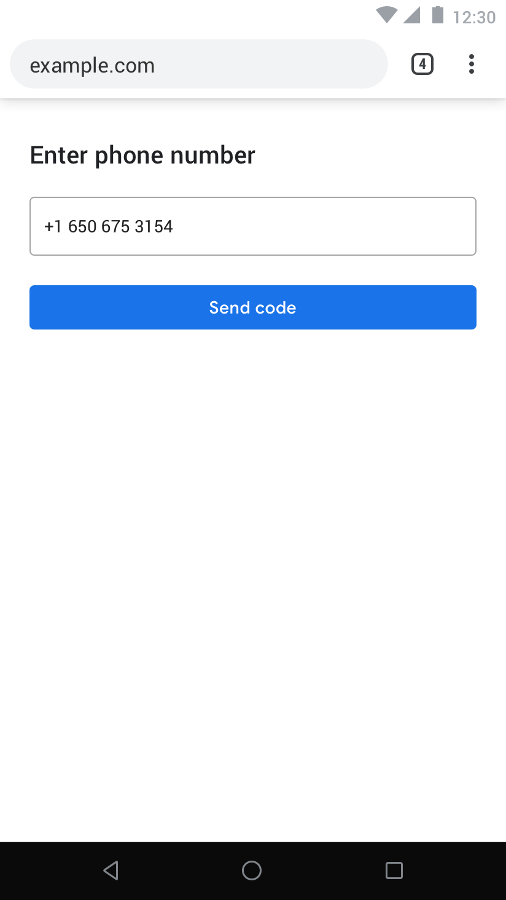
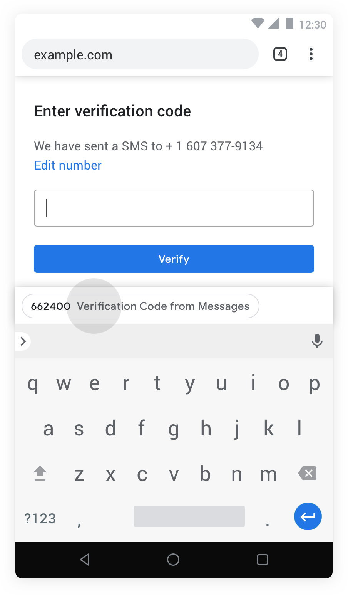

# Web OTPs

## TL;DR;

Many web sites rely on verifying phone numbers via sending one-time-passwords via SMS, which instructs users to copy/paste it into the website.

This a proposal for (a) a client side javascript API that enables web sites to request OTPs and (b) a server side formatting convention that enables browsers to route SMSes to them. Here is what the client side API looks like:

```javascript
let {otp} = await navigator.credentials.get({otp: true});
```

And here is the server side formatting convention:

```
Your verification code is: 123ABC78

@example.com #123ABC78
```

## Introduction

Developers use phone numbers for many aspects of building an application:

* account identifier (especially in emerging markets where email usage is low)
* social graph (based on phone number contact list for example)
* communication channel (i.e. call the user, send text message, etc.)u
* anti-abuse signal (phone numbers are limited, may require physical identity verification in some places)
* multi-factor auth (e.g. 2-step verification with SMS OTP)
* account recovery (e.g. look up a forgotten account, as a password reset option)

The challenge is that usage of phone numbers for these purposes typically requires proof that a user currently controls the phone number (phone number verification), and existing verification mechanisms on the web are cumbersome, requiring users to manually input one-time verification codes. Easing this has been a long standing feature request for the web from many of the largest global developers.

There are a variety of ways to verify control over phone numbers, but a randomly generated one-time passcode (OTP) sent by SMS to the number in question is the most common. Presenting this code back to developer’s server proves control of the phone number. In this proposal, we focus on the ability to programmatically obtain one-time codes from SMS as solution to ease the friction and failure points of manual user input of SMS codes, which is prone to error and phishing.

  * goal: make the most [common existing](#scenarios) phone number verification flow (SMS OTP) match ease of use in native apps.
  * non-goal: this proposal does not attempt to move developers off of existing phone number use cases and verification mechanisms, nor does it cover obtaining the phone number itself. Specifically, the developer must have previously obtained the phone number via existing mechanisms (e.g. user form input, autofill, etc.), which aren't addressed in this proposal.

## Prior Art

There are two comparable APIs that we should use as a reference.

First, the native [Android API](https://developers.google.com/identity/sms-retriever/overview) is an **imperative** API that gives access to the **full** contents of the SMS message. Here is what it looks like:

```java
// Starts SmsRetriever, which waits for ONE matching SMS message until timeout
// (5 minutes). The matching SMS message will be sent via a Broadcast Intent with
// action SmsRetriever#SMS_RETRIEVED_ACTION.
SmsRetrieverClient client = SmsRetriever.getClient(this /* context */);
Task<Void> task = client.startSmsRetriever();
```

In order to use the native SMS retrieval mechanism, the SMS message content must be formatted appropriately, with a hashcode derived from the native app package and cert fingerprint. For example:

```
<#> Your ExampleApp verification code is: 123ABC78
FA+9qCX9VSu
```

Secondly, Safari on iOS has a declarative [autocomplete](https://developer.apple.com/documentation/security/password_autofill/enabling_password_autofill_on_an_html_input_element) API that provides an integration with the native keyboard. iOS applies heuristics to extract OTPs from SMSes to pass it back to the `<input>` element. Here is what it looks like:

```html
<input autocomplete="one-time-code"/>
```

## Proposal

The following is an early exploration / baseline of what this API could look like. We expect them to change drastically as we learn more about the space.

From a UX perspective, we want to get out of the way as much as possible from the web author, while still keeping users aware and in control of what's going on.


To support this user flow, we propose two complementary API components:

* a client-side [javascript API](#imperative-api)
* a [formating convention](#formatting) for SMS messages

The former gives web pages a mechanism to receive SMSes and the latter is used as a mechanism to make sure that the origin boundaries are kept without additional mediation / gesture from the user. 

## API Alternatives Considered

There are two big formulations for this API that are more or less isomorphic to what's found on Android and iOS (see [prior art](#prior-art)).

As we evaluate these, it is critical that we agree on a consistent criteria to measure them. From a high level perspective, we used the following ordering of constituents:

1. **users** first
2. **developers** second
3. **browser** engineers third
4. technical **purity** last  

With users as our highest order constituent, here are some of the criteria we used to evaluate [alternatives](#alternatives-considered):

- privacy: to what extent does it secure the user's data?
- efficiency: does it increase conversion rates? decrease number of taps? 
- complexity: does it introduce new / unnecessary concepts?
- efficacy: does it cover all corner cases?

With that, before we go any further, the following are some of the UX alternatives we considered.

It is unclear if these formulations are necessarily mutually exclusive, but our intuition at the moment is that some of them are not.

Before we get into API design, from a UX perspective, our initial intuition was that, under the right circumstances (e.g. the PWA is installed), the following UX formulation would lead to the highest levels of conversion rates:



Having said that, here are other alternatives we considered.

### Alternatives Considered

There are many different UX formulations that are under consideration, with different trade-offs between user awareness, control and friction. Here are the ones worth exploring further:

##### Automatic UX

The automatic UX formulation ports the user experience you'd find on Android to the Web. 

In this formulation, all of the UX is delegated to the developer: status indicators, intent of the flow, etc. Whenever a browser implementation may find appropriate (e.g. when the PWA is installed, possibly), a browser may chose to share the SMS directly with the developer without any user consent.

Some positives here:

* no user friction / taps necessary
* no concept of OTP introduced

And the biggest challenge being:

* does it sufficiently protect the user's privacy?


##### Opt-Out UX

A variation of the previous UX that makes sure that the user is aware of what's going on, but still offers zero-tap conversion rates, is what we have been calling an opt-out UI:


##### Unblocking UX

On occasions where the user agent believes it is necessary to mediate / regulate (e.g. there isn't enough signals of trust established between the user and the origin) and get user consent before sharing the SMS, something like an InfoBar could be used: 


##### Opt-In UX

A more abrupt / opinionated variation of the latter UX is to use a modal dialog:



##### Autofill UX

At the end of the spectrum, the most regulated / mediated UX is the autofill UX, which makes sure that the intent to share is well established by making a suggestion with a keyboard accessory:



Now that we established some **users** first UX formulations, lets look into our second constituents, **developers**.

### Declarative API

The easiest starting point to enable this API is a declarative autocomplete field:

```html
<input autocomplete="one-time-code"/>
```

This has well established distribution and an existing implementation by Safari. It is ergonomically simple (easy to adopt) and effective (reuses the privacy properties of autofill suggestions).

While this doesn't seem at first **mutually exclusive** (and may be, in effect, collectively constructive), to close the gap with the [tap-less android user experience](#prior-art), the declarative API ties ourselves to:

* form elements
* the autofill permission model

So, working backwards from where we believe we want to be, the declarative autofill API wouldn't allow us to fully close the gap with the kind of experience that you'd find on [native apps](#automatic-ux).

### Imperative API

In this formulation, browsers provide an imperative API to request the contents of an incoming SMS. Here is one possible formulation / shape, based on Android’s [SMS Retriever API](https://developers.google.com/identity/sms-retriever/overview): 

```javascript
if (navigator.credentials) {
  alert("feature not available :(");
  return;
}
try {
  let {otp} = await navigator.credentials.receive();
  alert("otp received! " + otp);
} catch (e) {
  alert("timed out!");
}
```

There are a couple of nice side effects of the imperative API.

First, it can offer browser engines a spectrum of mediation / consent / permissions / interventions without any re-activation of the ecosystem (e.g. a [permission-less UX](#automatic-ux), a [non-blocking UX](#unblocking-ux) and an [autofill UX](#autofill-ux))

Second, it can derive the [declarative API](#Declarative-API) (the opposite isn't true). An interesting implication of uncovering the lower level imperative API is that it can derive the high level declarative API without any loss of (a) browser mediation and (b) graceful degradation.

Here is an example of a custom element that can be embedded in pages to polyfill existing deployments of the declarative autofill API:

```javascript
/**
 *  one-time-code is a custom element that extends <input> elements
 *  with an autocomplete="one-time-code" with the imperative
 *  navigator.credentials.get({otp: true}) API. Submits the form when it
 * receives the SMS.
 * 
 *  Example:
 *
 *  <form>
 *    <input is="one-time-code" required />
 *    <input type="submit" />
 *  </form>
 *
 *  Degrades gracefully to the autofill UI or manual input when the
 *  API is not available.
 *
 */
customElements.define("one-time-code",
  class extends HTMLInputElement {
    connectedCallback() {
      this.receive();
    }
    async receive() {
      try {
        let {otp} = await navigator.credentials.get({otp: true});
        this.value = otp;
        this.form.submit();
      } catch (e) {
        console.log(e);
      }
    }
  }, {
    extends: "input"
});
```

The main drawback of this formulation is that it is (deliberately) unaware of the `<input>` it is dealing with, so it can't necessarily be smart about it (e.g. suppress the virtual keyboard when the SMS arrives).

Arguably, the right long term answer is to allow custom elements to have greater controls while [participating in forms]([https://github.com/mozilla/standards-positions/issues/150](https://github.com/mozilla/standards-positions/issues/150)) but that is still an area of active research. 

### Formatting

In this proposal, to support the isolation between different origins (without extra user mediation), we define a formatting convention in the SMS message that enables them to be addressed to a specific origin and routed by the browser securely:

```
Your OTP is: 123ABC78.
@example.com: #123ABC78
```

Long term, we expect the formatting to be browser agnostic ([current formulation](https://github.com/samuelgoto/sms-receiver/issues/4#issuecomment-528991114) of the long term plan), but while GMS core releases are still rolling out, Android still needs an [app hash](https://developers.google.com/identity/sms-retriever/verify#computing_your_apps_hash_string) to know which APK it should redirect the SMS to. There is an interesting trick we could do to combine URLs with App Hashes, embedding them as URL parameters (making them valid android SMSes as well as valid web urls, which we can use to derive origins):

```
Your OTP is: 123ABC78.
@code.sgo.to #123ABC78 ^s3LhKBB0M33
```

In this formulation, the last few characters (e.g. `^s3LhKBB0M33`) are used to route the SMS from Android to the Browser APK and the origin is used to route from the Browser process to the right requesting tab. 

## Security

From a security perspective, the biggest consideration with this API is crossing an origin boundary, which we believe is mitigated by the [formatting](#formatting) addressing scheme.

This API is also **only** available via `https` or `localhost` (for development purposes). We don't entirely adopt the concept of [trustworthy urls](https://www.w3.org/TR/powerful-features/#is-url-trustworthy) because it covers more schemes (e.g. `data://123`) than we would like to (our initial intuition is that (a) `https` and `localhost` covers most cases and (b) it needs to be clear to the user what public facing entity its sending the SMS). 

This API is also **only** available on main frames, to avoid abuse by third party iframes / libraries.

## Privacy

From a privacy perspective, there are a few considerations to be taken:

- inner frames and ad networks
- fingerprinting
- awareness and control

The first concern is somewhat easy to address: we propose the API should be **unavailable outside of top level frames**.

The second and the third concerns are hard to be talked about abstractly, outside of a specific [UX formulation](#UX). We believe, however, that under the proposed UX formulation, the following attack vectors are addressed.

### User Tracking

Phone numbers are an effective stable identifier for a user that enable cross-site and online/offline tracking. Obtaining the phone number is the point at which user is typically (or should be) asked for consent and best educated about the implications of sharing this information, so is not addressed in this proposal.

However, the ability to verify the user’s phone number automatically in the background via an SMS retrieval API is a mechanism by which ongoing presence of the user could be determined, at least on a particular device where the developer already knows the phone number. Existing Android APIs mitigate this by allowing existing SMS notifications and SMS history to continue to be visible to the user, giving them insight that this may be happening (and providing a disincentive for a service to “guess” the user’s phone number, spam the number, and try to detect if this user is present by seeing if retrieval works). In practice, in the Android native app ecosystem, this hasn’t been found this to be a vector for abuse, especially given the cost of sending SMS and the visibility of the attack to users.

### Phishing

SMS OTP are readily phishable and an existing widespread concern. While not making this worse, this proposal attempts to mitigate by avoiding and lessening the occurrence of users to manually enter OTP (so as to be less conditioned to phishing, and/or more conscious of where they enter OTP), and by making the OTP only available via programmatic mechanism to the intended recipient (i.e. by specifying the target origin in the message contents).

## Annex

### Related APIs

#### Credential Management and WebAuthn APIs 

CM API and WebAuthn facilitate alternative forms of authentication. CM API facilitates interaction with password credentials and WebAuthn allows developers to interact with authentication hardware that provides much stronger, phishing resistant, and more usable multi-factor authentication on the web. While better alternatives for authentication, these APIs do not provide any communication mechanism or reputation signals that developers also use phone numbers for, so are not a comprehensive alternative to phone number or SMS OTP. 

#### Notifications

Browser notification APIs provide a communication channel to developers, but developers often still prefer or also request a verified phone numbers since it checks that the user is reachable at this number and facilitates voice communication and reasonably real-time two-way communication on practically any time of mobile phone (no dependence on OS or version, pretty much all phones can handle SMS). 

#### OAuth etc.

OAuth and similar protocols allow developers to obtain information such as verified phone number from an identity provider (IDP). However, this relies on user having provided, verified, and maintain their phone number with the IDP, and be comfortable using this model to share data (e.g. knowing their usage of 3p services). The IDPs themselves (unless an authoritative provider for a phone number, such as a carrier), need to verify phone number ownership, and typically still use SMS OTP for that purpose. 

#### reCAPTCHA

Captcha APIs provide an alternative anti-abuse signals (i.e. that user is not a bot) that developer sometime rely on phone numbers for (in that phone numbers are often limited and require human involvement to procure, and as such as hard to produce at scale).

#### Payment APIs

Phone numbers are sometimes used for carrier billing schemes. Payment APIs offer an alternative as well as signal of user quality (having a payment instrument often involves identity verification and ability / history of being able to pay).


#### Heuristic Autofill

In addition to autofill annotations, the browser could also heuristically extract and autofill OTP, with user confirmation and without explicit developer support. 

However, getting access to SMS without coordination from the developer (i.e. without explicit formatting of the SMS or indication that developer is expecting an SMS) will be a challenge, as browser would require ongoing access to SMS. 

Note that iOS provides heuristic-based OTP autofill, but iOS provides browser / keyboard access to SMS; but on Android, browsers may not have or even be able to request indefinite SMS access.

#### Phone Number Assertion API

If phone number has already been verified for a given device or user account, browser could return a verifiable assertion of the phone number. 

```
// This is just a draft/example of what a API could look like.
let phone = await navigator.credentials.get({phone: true});
verify(phone);
```

This could be implemented by having developer interact with identity providers (IDPs), which have already verified and are aware of the user’s phone number, and could vouch for this information, in the same way Google Sign-In and similar federated identity flows currently work for email addresses. 

Several identity providers such as Facebook (Account Kit), Truecaller, and others already provide APIs like this verified phone numbers.

### Spec

There are a couple of alternatives that we considered from an API shape perspective. First, subclassing `EventTarget`:

```javascript
let receiver = new OTPReceiver();
receiver.addEventListener("receive", ({content}) => {
  console.log(content);
});
receiver.receive();
```

But it seemed awkward since this is a one-shot event.

The other formulation that we think is worth noting is to use a static method outside of `navigator`. Example:

```javascript
let {content} = OTPReceiver.receive();
```

This could work equally well compared to `navigator.sms.receive()`, but would pollute the global namespace rather than the `navigator` namespace.

The other consideration here is whether to enable aborting the request or maybe pass a custom timeout:

```javascript
let abort = new AbortController();
setTimeout(() => {
  // abort after two minutes
  abort.abort();
}, 2 * 60 * 1000);
  
try {
  let {content} = await navigator.sms.receive(abort);
} catch (e) {
  // deal with errors
}
```
